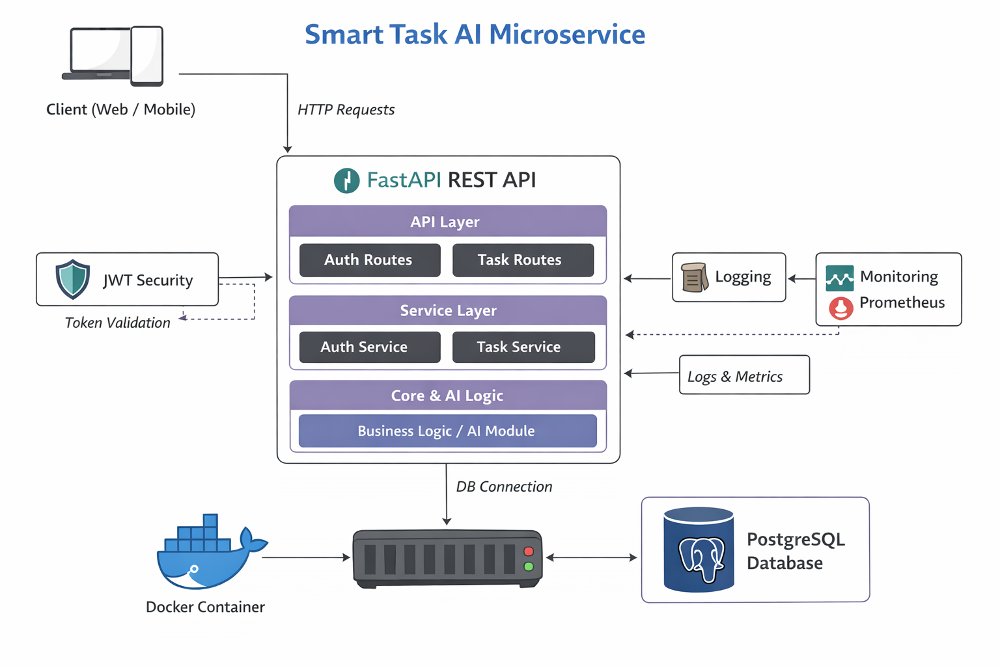

## 🚀 Smart Task AI Microservice

Smart Task AI is a production-style backend microservice designed using Clean Architecture principles.
The system provides task management functionality with JWT-based authentication and rule-based AI prioritization.

This project demonstrates core backend engineering concepts including:

* Clean Architecture
* RESTful API Design
* Containerization with Docker
* CI/CD pipeline with GitHub Actions
* Observability (logging & health checks)
* Security fundamentals (JWT & password hashing)
* Optional AI integration (rule-based task prioritization)

---

## 🏗 Architecture

```
app/
 ├── api/               # REST endpoints
 ├── core/              # Config, logging, security utilities
 ├── domain/            # Business models & logic
 ├── infrastructure/    # Database & external services
```

This separation ensures:

* Business logic is independent of frameworks
* Infrastructure can be replaced without affecting domain logic
* Clear separation of concerns


<p align="center">
  
</p> 

---

## 🔐 Security

* JWT-based authentication
* Password hashing
* Protected task endpoints

---

## 🤖 AI Component

A simple rule-based AI module automatically assigns task priority based on:

* Deadline proximity
* Task keywords
* Urgency patterns

---

## 🐳 Containerization

The application runs fully inside Docker:

* FastAPI service
* PostgreSQL database
* Docker Compose orchestration

Run locally with:

```
docker compose up --build
```

---

## ⚙ CI/CD

The project includes a GitHub Actions pipeline that automatically:

* Installs dependencies
* Verifies application import
* Builds the Docker image

This ensures code integrity and build consistency on every push.

---

## 📊 Observability

* Structured logging
* Health endpoint (`/health`)
* Prometheus instrumentation support

---

## 📌 Health Check

```
GET /health
```

Response:

```
{ "status": "ok" }
```

---

## 🧠 Technologies Used

* FastAPI
* PostgreSQL
* SQLAlchemy
* Docker
* GitHub Actions
* JWT
* Prometheus Instrumentator

